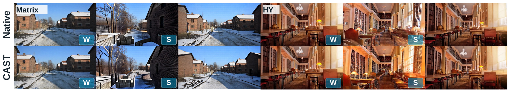
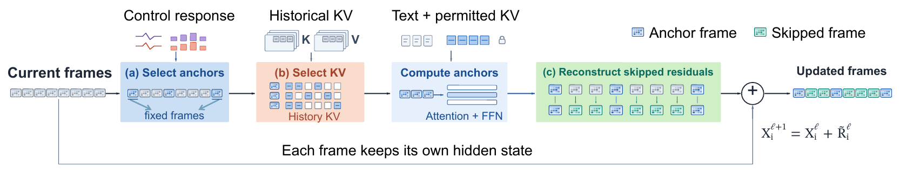

# CAST: Reconstruction-Coupled Acceleration of Interactive World Models

### Training-free acceleration for interactive video generation

[🎮 Matrix-Game 3.0](https://github.com/SkyworkAI/Matrix-Game) | [📦 CAST Components](src/interaction_accel/) | [⚙️ Configuration](configs/cast_matrix.json) | [🖼️ Figures](assets/)

## 🎥 Qualitative Results



*Native rollouts are above CAST rollouts. Matrix-Game 3.0 is on the left and HY-World 1.5 is on the right; W/S indicate forward/backward movement. This repository releases the Matrix implementation only.*

## 💡 Introduction

CAST is a training-free framework for interactive world models. It coordinates which frames receive exact updates, how skipped residuals are reconstructed, and which historical key/value (KV) blocks support that reconstruction. This README follows the manuscript's method definitions and terminology.

## 💡 Highlights



*CAST routes frame and historical-KV computation before evaluating anchors. Each frame retains its own hidden-state skip connection.*

- **Control-Aware Frame Selection (CAFS)** ranks current frames using recent camera/action response and cross-layer refresh debt. It selects anchor frames before the expensive visual residuals are computed.
- **Phase-Aware Reconstruction (PAR)** computes visual residuals for anchors, aligns neighboring anchor spectra by a confidence- and frequency-dependent phase shift, then reconstructs skipped residuals. Each skipped frame keeps its own hidden-state skip connection. Memory frames remain exact.
- **Reconstruction-Coupled Sparse Attention (RCSA)** begins with pooled query/key historical-block selection and refines KV supports according to local omission effects and the intervals an anchor helps reconstruct. It preserves the fixed historical KV budget and native causal permissions.

## 📦 Released Components

```text
CAST/
├── assets/                             Figures in the paper
├── configs/cast_matrix.json            Fixed Matrix settings
├── configs/cast_matrix_candidate.json  Matrix/Light Interaction candidate settings
├── src/interaction_accel/cast_matrix.py
│                                       Fixed Matrix component factory
├── src/interaction_accel/methods/proposed/
│                                       Method and delivery dependencies
├── scripts/check_release.py            Offline source and configuration checks
├── SOURCE_MANIFEST.json                Source hashes and provenance
└── LICENSE                             MIT license
```

The source keeps its original module paths to preserve internal imports and numerical behavior. Shared modules contain alternate branches because CAST calls their classes and helpers. This release does not include the research benchmark runner, unrelated methods, model weights, datasets, or generated outputs.

## 📋 Requirements

- A Matrix-Game 3.0 and Light Interaction runtime with the upstream model assets and CUDA environment.
- Python 3.10 or newer, plus the dependencies declared in [`pyproject.toml`](pyproject.toml): PyTorch, Triton, NumPy, torchvision, and imageio.
- Matrix's `wan` package and the Light Interaction sparse-attention backend for integration with the generation pipeline.

Obtain upstream code and assets under their respective licenses. The upstream revisions used for this source snapshot are recorded in [`NOTICE.md`](NOTICE.md).

## 🚀 Quick Start

CAST is used inside a Matrix-Game 3.0 generation pipeline. First prepare a working runtime and model assets following the [Matrix-Game 3.0 setup](https://github.com/SkyworkAI/Matrix-Game/blob/main/Matrix-Game-3/README.md) and [Light Interaction Matrix setup](https://github.com/2843721358l-del/Light-Interaction-Project/blob/main/matrix-game-3.0/README.md). The revisions used for this source snapshot are listed in [`NOTICE.md`](NOTICE.md).

### 1. Install CAST

From the `CAST` directory, in that runtime's Python environment:

```bash
python -m pip install -e .
python scripts/check_release.py
```

The check verifies that the packaged source and configuration are intact; it does not load a model.

### 2. Attach CAST to the Matrix model

In the runner, after loading Matrix's 30-block DiT model and before the first generated chunk:

```python
from interaction_accel.cast_matrix import make_cast_components

memory_compiler, attention_compiler, frame_weave = make_cast_components()
frame_weave.install(model)
```


```python
frame_weave.begin_model_call(
    chunk_index=chunk_index,
    step_index=step_index,
    current_action=current_action,
    memory_atoms=len(active_atoms),
    world_alignment_geometry=world_geometry,
    model_device=model_input.device,
)
try:
    prediction = model(**model_kwargs)
except BaseException:
    frame_weave.abort_model_call()
    raise
prediction = frame_weave.finish_model_call(prediction)
```

Build `world_geometry` from the current and selected Memory **absolute** camera poses, intrinsics, and latent indices. [`MatrixWorldGeometryRuntime`](src/interaction_accel/methods/proposed/matrix_world_spectral_residual.py) captures these at the pipeline boundary and provides `snapshot(memory_length=len(active_atoms))`. The runner remains responsible for model loading, the Light Interaction q1 cache, chunk state, and video output. Call `frame_weave.uninstall()` when retiring the model.

## 📊 Evaluation

On the manuscript's Matrix protocol, CAST reports **2.15× speedup over Native** and **0.7570 VBench**. `python scripts/check_release.py` verifies source hashes, Python syntax, configuration, and file hygiene; it does not run GPU inference or reproduce the manuscript's evaluation.

## 📄 License

The CAST source in this folder carries the original MIT license. Upstream projects and model assets have their own terms; see [`NOTICE.md`](NOTICE.md).
